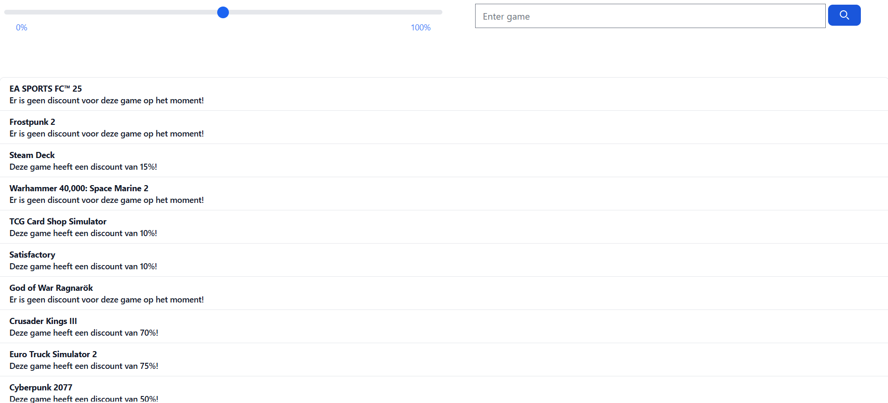
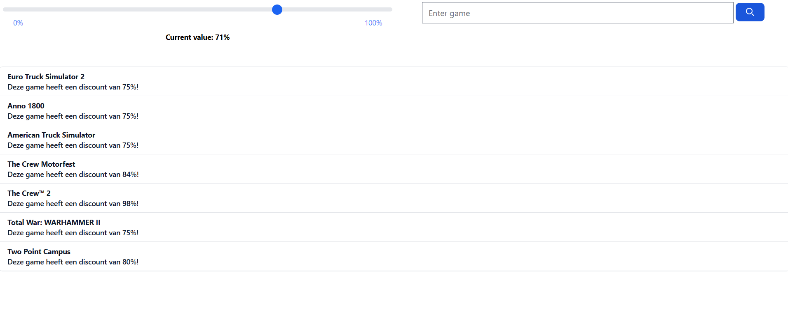

# IT-Challenges 3 - Astro Project
## 📌 Project overview
This repository contains the source code of an Astro web application that I developed for the IT-Challenges 3 course.

The application retrieves a list of games from a JSON file and displays them in a dynamic interface with filtering and search functionality.

👉 **Live demo:** https://game-price-slider-astro-project.netlify.app

## 🎯 Goal of the project
This project was developed as a mandatory assignment within IT-Challenges 3.

The project demonstrates the use of:
- Astro as a frontend framework
- Dynamic rendering based on JSON data
- Client-side filtering and search functionality
- Interactive UI components (slider + live search)

## 🧠 Functionalities
### Game Overview
- Games are loaded from a JSON dataset
- Responsive display of all games

### Discount Filter (slider)
- Filters games based on minimum discount
- Shows only games with a discount ≥ set value
- Default value: 50%

### Search Functionality
- Live search in game titles
- Works independently of the slider filter
- Results are updated in real-time as you type

## 📆 Development time frame
This project was developed between:
- **September 2024**
- **6 October 2024**

## 🛠️ Technologies
- Astro
- HTML
- CSS
- JavaScript
- TypeScript
- Tailwind CSS
- GitHub Actions

## ⚙️ Local installation
This project can be started locally with Astro via:
```bash
npm install
npm run dev
```

## 📸 Screenshots
### Homepage
The homepage of the application.


### Discount filter (slider)
Games are filtered based on the set discount percentage.


### Search functionality
Live search function that filters games based on entered text.


## 🌐 Languages
- English (current)
- Dutch: [`README_NL.md`](README_NL.md)