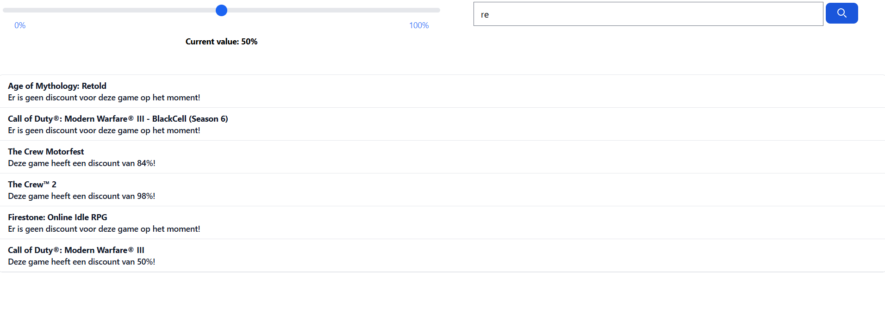

# IT-Challenges 3 - Astro Project
## 📌 Projectoverzicht
Deze repository bevat de broncode van een Astro-webapplicatie die ik heb ontwikkeld voor het vak IT-Challenges 3.

De applicatie haalt een lijst met games op uit een JSON-bestand en toont deze in een dynamische interface met filtering- en zoekfunctionaliteit.

👉 **Live demo:** https://game-price-slider-astro-project.netlify.app

## 🎯 Doel van het project
Dit project werd ontwikkeld als verplichte opdracht binnen IT-Challenges 3.

Het project toont het gebruik van:
- Astro als frontend framework
- Dynamische rendering op basis van JSON-data
- Client-side filtering en zoekfunctionaliteit
- Interactieve UI-componenten (slider + live search)

## 🧠 Functionaliteiten
### Game-overzicht
- Games worden ingeladen vanuit een JSON-dataset
- Responsive weergave van alle games

### Kortingsfilter (slider)
- Filtert games op basis van minimumkorting
- Toont enkel games met korting ≥ ingestelde waarde
- Standaardwaarde: 50%

### Zoekfunctionaliteit
- Live zoeken in gametitels
- Werkt onafhankelijk van de sliderfilter
- Resultaten worden realtime aangepast tijdens het typen

## 📆 Ontwikkelingsperiode
Dit project werd ontwikkeld tussen:
- **september 2024**
- **6 oktober 2024**

## 🛠️ Technologieën
- Astro
- HTML
- CSS
- JavaScript
- TypeScript
- Tailwind CSS
- GitHub Actions

## ⚙️ Lokale installatie
Dit project kan lokaal worden gestart met Astro via:
```bash
npm install
npm run dev
```

## 📸 Screenshots
### Hoofdpagina
De hoofdpagina van de applicatie.


### Kortingsfilter (slider)
Games worden gefilterd op basis van het ingestelde kortingspercentage.


### Zoekfunctionaliteit
Live zoekfunctie die games filtert op basis van ingevoerde tekst.


## 🌐 Talen
- Nederlands (huidige)
- Engels: [`README.md`](README.md)